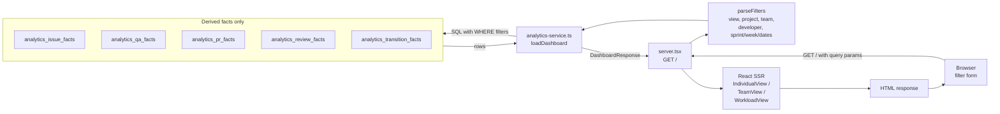

# Engineering Management Dashboard

A local-first analytics app that visualizes team activity from Jira and GitHub through three role-aware dashboards: **Individual**, **Team**, and **Workload Insights**. 

The application is intended to answer:

- who delivered work
- how much work was delivered
- how quickly work moved
- how activity breaks down by developer, project, team, sprint, and week
- how work moves between workflow states
- how contribution should be interpreted differently by engineering role


The app:

- runs entirely on your laptop (Node + SQLite)
- pulls data **read-only** from Jira and GitHub
- caches everything locally so dashboards render fast without hitting the source APIs again
- never modifies external data

Project setup:
- Agent.md contains the context for agents. This file also relies on guardrails defined in the documents in docs folder. Please update the context for your specific setup.

---

## Quick start (onboarding)

### Prerequisites

- **Node.js ≥ 20**
- A **Jira API token** — generate at https://id.atlassian.com/manage-profile/security/api-tokens
- A **GitHub personal access token** with `repo` read scope

### Steps

```bash
# 1. Install dependencies
npm install

# 2. Configure environment
cp .env.example .env
$EDITOR .env       # fill in JIRA_*, GITHUB_TOKEN, APP_PROJECTS_JSON, APP_DEVELOPER_ROLES_JSON

# 3. Start the dev server (tsx watch mode)
npm run dev

# 4. Open the dashboard
open http://127.0.0.1:3100

# 5. Trigger the first sync
#    Click "Sync Now" in the topbar.
#    First run backfills from SYNC_START_DATE.
#    Subsequent runs continue incrementally from saved cursors.
```

That's it — once the first sync completes, all three dashboards have data.

### Required `.env` values

See [`.env.example`](.env.example) for the full template. The most important keys:

| Variable | Purpose |
|---|---|
| `DATABASE_PATH` | Local SQLite file relative to the project root (default `engineering-management-dashboard.db`) |
| `SYNC_START_DATE` | First-run backfill floor, `YYYY-MM-DD` |
| `CURSOR_OVERLAP_HOURS` | Safety overlap on incremental syncs (default 24h) |
| `JIRA_BASE_URL`, `JIRA_EMAIL`, `JIRA_API_TOKEN` | Jira credentials |
| `JIRA_STORY_POINTS_FIELD`, `JIRA_SPRINT_FIELD` | Custom-field IDs for points + sprint |
| `GITHUB_REPO_OWNER`, `GITHUB_TOKEN` | GitHub credentials |
| `APP_PROJECTS_JSON` | Project / team / Jira-key / GitHub-repo mapping |
| `APP_DEVELOPER_ROLES_JSON` | Canonical developer roster — also acts as the analytics **allowlist** |
| `APP_WORKFLOW_JSON` _(optional)_ | Override the 5 Jira workflow status names — see [Customizing for your workflow](#customizing-for-your-workflow) below |

> **Note on the developer allowlist.** Only developers in `APP_DEVELOPER_ROLES_JSON` appear in derived analytics. Bots, hashed IDs, and former teammates fetched from Jira/GitHub are stored in raw tables but excluded from dashboards. To add or remove someone: edit `.env`, restart the server, and click **Sync Now**.

### Customizing for your workflow

The app references five Jira status names internally — `closed`, `inProgress`, `underReview`, `readyForQa`, `qaComplete`. They drive QA attribution, lifecycle durations on the Workload dashboard, and the workflow-state sort order in transition timing tables.

If your team's workflow uses different display names (e.g. `Doing` instead of `In Progress`, `Done` instead of `Closed`), set `APP_WORKFLOW_JSON` in `.env`:

```bash
APP_WORKFLOW_JSON='{
  "statuses": {
    "closed": "Done",
    "inProgress": "Doing",
    "underReview": "In Review",
    "readyForQa": "Ready for QA",
    "qaComplete": "QA Approved"
  }
}'
```

After editing, restart the server and click **Sync Now** — the fact-table rebuild will re-derive everything under the new mapping.

If `APP_WORKFLOW_JSON` is unset, the defaults match the original workflow exactly, so existing deployments need no change.

> Status name matching is **case-insensitive** at runtime, so `Resolved - Ready for QA` and `Resolved - Ready For QA` both match. You only need to override `APP_WORKFLOW_JSON` when the actual words differ.

---

## Three dashboards

Switch between them using the tabs in the topbar.

| Dashboard | What it shows | Use it for |
|---|---|---|
| **Individual** (default) | Per-developer metric cards with a 50th-percentile peer reference, weekly activity table, peer-comparison tables | One-on-ones, calibration |
| **Team** | Aggregate productivity, collaboration, contribution profiles, sprint trends, transition timing | Team retros, stand-ups |
| **Workload Insights** | Story-point distribution pie, per-bucket lifecycle durations (wall-clock), velocity (items + points per sprint) | Estimation accuracy reviews |

Each view respects the same global filter set (Developer / Project / Team / Sprint / Week / Date Range / Period).

---

## Data flow

The app has three layers — data flows top-down on sync, bottom-up on dashboard read.

### Sync (write path)

```mermaid
flowchart LR
  JIRA[Jira REST API]:::ext
  GH[GitHub REST API]:::ext

  subgraph SyncFn["sync-service.ts<br/>POST /sync"]
    direction TB
    Cursors[(sync_state<br/>cursors)]
    Sync[fetch since cursor<br/>upsert raw rows<br/>rebuild facts]
    Cursors -.read.-> Sync
    Sync -.write new cursor.-> Cursors
  end

  JIRA -->|read-only| Sync
  GH -->|read-only| Sync

  subgraph Raw["Raw warehouse (SQLite)"]
    issues
    comments
    issue_sprints
    jira_issue_history
    jira_qa_attribution
    jira_status_transitions
    github_pull_requests
    github_pull_request_reviews
  end

  Sync -->|upsert| Raw

  subgraph Derived["Derived analytics fact tables<br/>(DELETE + repopulate on every sync)"]
    AIF[analytics_issue_facts]
    AQF[analytics_qa_facts]
    APF[analytics_pr_facts]
    ARF[analytics_review_facts]
    ATF[analytics_transition_facts]
  end

  Raw -->|rebuildDerivedAnalytics| Derived

  classDef ext fill:#e8dcc6,stroke:#1a2235,color:#1a2235;
```



**What happens during a sync (in order):**

1. Read each source's saved cursor from `sync_state` (or use `SYNC_START_DATE` if first run).
2. Fetch new/updated items from Jira and GitHub since the cursor minus `CURSOR_OVERLAP_HOURS`.
3. Upsert the fetched rows into the raw warehouse tables.
4. Backfill canonical developer aliases (matching Jira display name + GitHub login to the configured roster).
5. Save the new cursor (latest `transitioned_at` / `merged_at` / `submitted_at` per source).
6. **Drop and rebuild every derived fact table** from the raw warehouse using the developer allowlist. This is what makes a dashboard refresh visible.

The whole pipeline is idempotent — running Sync Now twice in a row produces the same result as running it once.

### Dashboard read (browser → screen)



**Highlights:**

- Request-time SQL hits **only the 5 derived fact tables**, never raw Jira/GitHub data — keeps dashboard latency low.
- Every fact table uses the same column shape (project_name, team_name, role, developer, sprint_name, metric_week, metric_date, …), so a single `buildWhere(filters)` helper builds every WHERE clause.
- The whole page is server-rendered React (no client-side charting libraries). The only client JS is small inline snippets for filter mutual-exclusion logic, the sync-button progress indicator, and UTC→local timestamp conversion.

### Why a two-tier pipeline

- **Raw warehouse** keeps everything fetched, lossless, for re-derivation.
- **Derived facts** are denormalized to the dimensions the UI cares about (date / week / sprint / project / team / role / developer), so dashboard reads stay simple SQL.
- Adding a new metric usually means adding a column or a new fact table — no re-fetch from Jira/GitHub.

For column-level details and the rules that govern each fact, see [`docs/analytics-architecture.md`](docs/analytics-architecture.md).

---

## Local development

### Common tasks

```bash
npm run dev      # tsx watch mode + hot reload (recommended)
npm run build    # compile to dist/ via tsc
npm start        # run the compiled output
```

### Running the test suite

The project uses [Vitest](https://vitest.dev/) with an in-memory SQLite database — no `.env` or external services needed.

```bash
npm test               # run all tests once
npm run test:watch     # re-run on file change (great during development)
```

**269 tests** across 8 files covering every layer of the pipeline:

| Test file | What it covers |
|---|---|
| `date-utils.test.ts` | `weekStart`, `formatDateOnly`, `parseStoredOrIsoDate`, `parseJiraDurationToMinutes`, overlap/floor helpers |
| `sprint-utils.test.ts` | Sprint object + legacy-string parsing, naming-regex rules, primary-sprint selection |
| `config.test.ts` | `APP_PROJECTS_JSON`, `APP_DEVELOPER_ROLES_JSON`, `APP_WORKFLOW_JSON` — valid input, defaults, all error paths |
| `filter-utils.test.ts` | URL → `AnalyticsFilters` mapping, delivery-mode mutual exclusion, period resolution |
| `warehouse.test.ts` | Schema init, indexes, `addColumnIfMissing` migrations, sync cursor CRUD |
| `identity-store.test.ts` | Alias upsert / resolution, `backfillCanonicalDeveloperData` across all four tables |
| `sync-service.test.ts` | `buildQaStatusMatcher` (case-insensitive), `rebuildDerivedAnalytics` end-to-end with raw mock data — allowlist, lifecycle durations, idempotency |
| `analytics-service.test.ts` | `median`, `percentileRank`, `buildWhere`, transition sorting, `loadDashboard` across all three dashboard views |

All tests run against an **in-memory SQLite database** created fresh per test — no teardown scripts or shared state.

### Resync from scratch

If your local DB gets into a strange state, blow it away:

```bash
rm engineering-management-dashboard.db
npm run dev      # creates a fresh DB on startup
# click Sync Now in the UI — first run backfills from SYNC_START_DATE
```

### Manual sync via API

The Sync Now button POSTs to `/sync`. You can also hit it directly:

```bash
curl -X POST http://127.0.0.1:3100/sync -d 'returnTo=/'
```

### JSON API

```bash
curl 'http://127.0.0.1:3100/api/v2/dashboard?view=individual&developer='
```

Returns the full `DashboardResponse` shape (see [`src/shared/types.ts`](src/shared/types.ts)).

---

## File organization

| Path | Purpose |
|---|---|
| [`src/shared/types.ts`](src/shared/types.ts) | Shared domain types used by both backend + frontend |
| [`src/shared/config.ts`](src/shared/config.ts) | App configuration loader |
| [`src/backend/warehouse.ts`](src/backend/warehouse.ts) | SQLite schema + safe column migrations |
| [`src/backend/sync-service.ts`](src/backend/sync-service.ts) | Jira/GitHub fetchers, raw upserts, derived-fact rebuild |
| [`src/backend/analytics-service.ts`](src/backend/analytics-service.ts) | Request-time aggregation, peer comparisons, view-specific data builders |
| [`src/backend/filter-utils.ts`](src/backend/filter-utils.ts) | URL → `AnalyticsFilters` parsing and period resolution |
| [`src/backend/server.tsx`](src/backend/server.tsx) | HTTP server, view dispatch |
| [`src/frontend/dashboard-page.tsx`](src/frontend/dashboard-page.tsx) | Page shell, topbar, filter form, dashboard dispatch |
| [`src/frontend/individual-view.tsx`](src/frontend/individual-view.tsx) | Individual dashboard |
| [`src/frontend/team-view.tsx`](src/frontend/team-view.tsx) | Team dashboard |
| [`src/frontend/workload-view.tsx`](src/frontend/workload-view.tsx) | Workload Insights dashboard |
| [`src/frontend/shared-components.tsx`](src/frontend/shared-components.tsx) | Reusable UI primitives (FilterField, TableCard, ContributionProfilesTable, …) |
| [`src/frontend/svg-charts.tsx`](src/frontend/svg-charts.tsx) | Server-rendered SVG charts (BarChart, MetricWithChart, PieChart, WorkloadPieCard) |
| [`src/backend/__tests__/`](src/backend/__tests__/) | Test suite — 269 tests, Vitest, in-memory SQLite |

---

## Documentation

| File | Topic |
|---|---|
| [`docs/product-context.md`](docs/product-context.md) | Product intent, themes, source systems |
| [`docs/dashboard-views.md`](docs/dashboard-views.md) | Every panel on every dashboard |
| [`docs/analytics-architecture.md`](docs/analytics-architecture.md) | Pipeline layers, fact-table columns |
| [`docs/domain-rules.md`](docs/domain-rules.md) | Non-negotiable business rules (sprint naming, QA attribution dedup, cycle-time peer-median rule, etc.) |
| [`AGENTS.md`](AGENTS.md) | Start-here for AI agents working in the repo |
